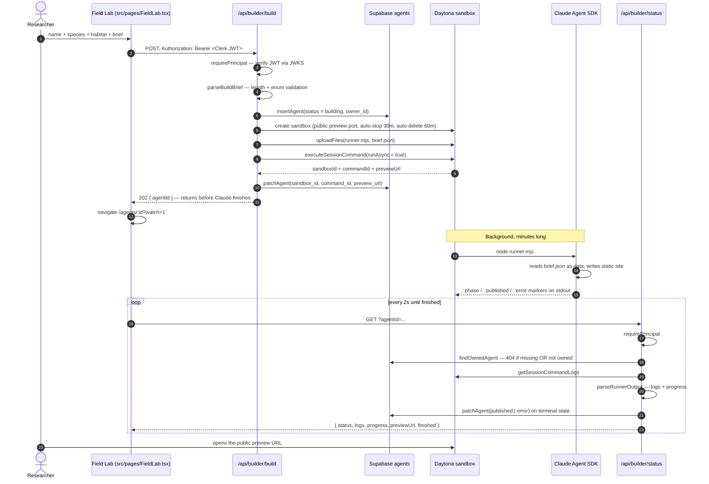

# CLAUDE.md — Agents in the Wild

Project instructions for Claude Code working in this repo.

**One-liner:** Describe an app in plain English; Claude Code builds it inside an
isolated Daytona sandbox, and Agents in the Wild publishes a live, shareable
preview while Builder Bros tracks it in Supabase.

Source of truth for scope: [`hackathon-prd.md`](./hackathon-prd.md).
Design language is lifted from the live `agentsinthewild.com` bundle — dark oklch
palette, Instrument Serif / Instrument Sans / JetBrains Mono, and the site's own
vocabulary ("Raise something wild", "The Wilds", "out hunting", "Daytona habitat").

---

## Commands

```bash
npm install
npm run dev            # http://localhost:5173 — Vite also mounts the api/ handlers
npm run check          # frontend typecheck
npm run check:api      # separate api/ typecheck (different tsconfig, node types)
npm run check:builder  # 40 builder security invariants — the gate that matters
npm run build          # production build
npm run smoke          # 11-step end-to-end flow against a live dev server
npm run verify         # all of the above, in order
```

Run `npm run verify` before claiming any builder change works. `check:builder` and
`smoke` are the two that catch real regressions; the typechecks alone do not.

**Field-lab mode.** With no env vars set the whole app runs: local session,
in-memory roster, simulated build walking the same state machine. Real Daytona
execution activates when `DAYTONA_API_KEY` + `ANTHROPIC_API_KEY` are both present.
See `.env.example`.

---

## Flow map — releasing an agent



### Module map

```text
src/                                      api/
├── main.tsx ── AuthProvider ─────────┐   ├── builder/
│                                     │   │   ├── build.ts    POST  → 202
├── pages/                            │   │   └── status.ts   GET   owner-only
│   ├── Landing.tsx                   │   ├── agents/
│   ├── Marketplace.tsx  ─────────────┼──▶│   │   ├── index.ts    public list / ?scope=mine
│   ├── FieldLab.tsx     ─────────────┼──▶│   │   └── [id].ts     public detail
│   ├── Dashboard.tsx    ─────────────┼──▶│   ├── preview.ts      field-lab stand-in preview
│   └── AgentDetail.tsx  ─────────────┘   └── _lib/
│         └── BuildConsole.tsx                ├── auth.ts     Clerk JWKS | demo token
│                                             ├── prompt.ts   validation, BRIEF_MAX_LENGTH
├── lib/                                      ├── runner.ts   RUNNER_SOURCE (fixed constant)
│   ├── auth.tsx      Clerk | demo session    ├── daytona.ts  SDK client + simulator
│   ├── api.ts        typed fetch client      ├── store.ts    PostgREST + in-memory
│   ├── useBuildStatus.ts  2s polling         ├── env.ts      server-only credentials
│   ├── types.ts      shared shapes           └── http.ts     json/fail/HttpError
│   └── format.ts     wild-themed labels
└── components/ui.tsx                      supabase/schema.sql   agents table + public view
                                           scripts/check-builder.mjs  security gate
                                           scripts/smoke.mjs          e2e flow
```

### State machine

```text
                  ┌──────────┐
                  │   idle   │  (never written by the builder today)
                  └──────────┘
                       │ POST /api/builder/build
                       ▼
   ┌───────────────────────────────────────┐
   │              building                 │◀── survives navigation: sandbox_id +
   │  logs stream from the session command │    command_id live on the owned row
   └───────────────────────────────────────┘
          │ ::published                │ ::error, non-zero exit, or launch failure
          ▼                            ▼
   ┌──────────────┐             ┌──────────────┐
   │  published   │             │    error     │
   │ preview_url  │             │ error_message│
   │ hunts += 1   │             │ owner-only   │
   └──────────────┘             └──────────────┘
```

---

## Features — what is built

| Area | Feature | State |
| --- | --- | --- |
| Auth | Clerk bearer token verified server-side via JWKS (`jose`) | ✅ |
| Auth | Field-lab session fallback when no Clerk keys are set | ✅ |
| Auth | Header sign-in / sign-out, gated Field Lab and Dashboard | ✅ |
| Builder | `POST /api/builder/build` — auth → validate → insert → Daytona → `202` | ✅ |
| Builder | Returns before Claude finishes (background session command) | ✅ |
| Builder | Brief uploaded as `brief.json`, read with `JSON.parse` | ✅ |
| Builder | `RUNNER_SOURCE` / `BUILD_COMMAND` are interpolation-free constants | ✅ |
| Builder | Sandbox agent limited to `Read/Write/Edit/Glob/Grep` | ✅ |
| Builder | `Bash`, `WebFetch`, `WebSearch`, `Task`, `NotebookEdit` denied | ✅ |
| Builder | Runner verifies `index.html` exists, then serves the site | ✅ |
| Builder | Static file server with path-traversal guard inside the sandbox | ✅ |
| Status | `GET /api/builder/status` — owner-only, 404 for missing *or* unowned | ✅ |
| Status | `::phase` / `::published` / `::error` marker parsing → logs + progress | ✅ |
| Status | Patches Supabase on terminal states, so a closed tab still resolves | ✅ |
| Status | 2s client polling, resumes after navigation | ✅ |
| Data | Supabase PostgREST driver with service-role key, server-side only | ✅ |
| Data | In-memory driver + seed roster when Supabase is absent | ✅ |
| Data | Public projection omits `owner_id`, `sandbox_id`, `command_id`, `error_message` | ✅ |
| Data | `supabase/schema.sql` — table, indexes, RLS on, public view | ✅ |
| UI | Landing, The Wilds marketplace (search + species filter) | ✅ |
| UI | Field Lab release form with live character budget | ✅ |
| UI | Dashboard roster with stat tiles and 5s refresh | ✅ |
| UI | Agent detail with live build console, progress bar, preview CTA | ✅ |
| UI | Empty / error / 404 states in the site's voice | ✅ |
| Lifecycle | Sandbox `public: true`, auto-stop 30m, auto-delete 60m | ✅ |
| Quality | `check`, `check:api`, `check:builder` (40 invariants), `build` | ✅ |
| Quality | `smoke` — 11-step end-to-end flow, all passing | ✅ |
| Deploy | `vercel.json` — Node 22 functions, SPA rewrites | ✅ |

## Features — what needs to be built

Ordered roughly by what a demo or a real deployment needs first.

| Priority | Gap | Notes |
| --- | --- | --- |
| **P0** | **Verify the live Daytona path** | `api/_lib/daytona.ts` is written against the installed `@daytona/sdk` type definitions but has never run against the real API. Confirm `create` / `uploadFiles` / `executeSessionCommand` / `getSessionCommandLogs` / `getPreviewLink` behave as typed, and that `cmdId` is the field returned. |
| **P0** | **Verify Clerk JWT verification** | `CLERK_JWT_ISSUER` + JWKS path untested against a real instance. Confirm the `sub` claim is the id Supabase rows are keyed on. |
| **P0** | **Run `schema.sql` against the real project** | Reconcile with the existing Builder Bros `users` / `projects` / `sandboxes` tables and the 6 exported Convex agents (4 wild, 2 owned). The seed block in the schema is a single illustrative row, not the real export. |
| **P1** | **Sandbox cleanup trigger** | `destroySandbox()` exists but is never called. Needs a cron or a post-publish sweep; today only Daytona's `autoDeleteInterval` reclaims sandboxes. |
| **P1** | **Rate limiting / quota on `/api/builder/build`** | Nothing stops one user from opening dozens of sandboxes. Per-owner concurrent-build cap belongs on the owned row. |
| **P1** | **Real preview health check** | `status` trusts the `::published` marker. It should confirm the preview URL actually answers before flipping to `published`. |
| **P1** | **Build cancellation** | The site's copy has "Abort Agent"; there is no abort route. Needs a `DELETE`/`POST /api/builder/abort` that kills the session command and sets `error`. |
| **P2** | **Retry / rebuild** | No way to re-run a failed brief without creating a new agent. |
| **P2** | **Unit tests** | Only the security gate and the e2e flow exist. `parseRunnerOutput`, `parseBuildBrief`, and the projections deserve direct tests (no test runner installed yet). |
| **P2** | **Log persistence** | Logs are read live from Daytona. Once the sandbox is deleted the build history is gone; nothing is written to Supabase. |
| **P2** | **`hunts` semantics** | Incremented once on publish. The real site treats hunts as agent invocations — needs a definition and a counter that matches it. |
| **P2** | **Marketplace pagination** | Both list endpoints hard-cap at 48 rows with no cursor. |
| **P3** | **Rest of the site surface** | The live site also has `/about`, `/pricing`, `/security`, `/blog`, `/careers`, `/contact`, `/status`, `/terms`, `/privacy`, `/account`, `/checkout`. None are in this repo. |
| **P3** | **Billing** | No billing model here by design; the PRD reuses Builder Bros' existing one. |
| **P3** | **Per-app GitHub / Vercel export** | Explicitly out of scope — the PRD's stated demo ceiling. Wait until ownership, quotas, domain lifecycle, and cleanup policy are defined. |

---

## Invariants — do not break these

`npm run check:builder` enforces every item below. If a change makes it fail, the
change is wrong, not the gate.

1. **Auth precedes side effects.** `requirePrincipal(req)` must appear before any
   `insertAgent`, `findOwnedAgent`, `launchBuild`, or `readBuildLogs` call.
2. **User input is data.** Never interpolate a brief into `RUNNER_SOURCE`,
   `BUILD_COMMAND`, or any shell string. Upload it as a file and parse it.
3. **File tools only.** Do not widen `allowedTools`; do not shrink
   `disallowedTools`.
4. **Public projections leak nothing.** `toPublic` must never return `owner_id`,
   `sandbox_id`, `command_id`, or `error_message`.
5. **Missing and unowned look identical.** `findOwnedAgent` returns the same 404
   for both, so agent ids cannot be probed.
6. **Credentials are server-side.** Anything secret is read only in
   `api/_lib/env.ts` and never prefixed `VITE_`.
7. **Build returns immediately.** `build.ts` must not import `readBuildLogs`, and
   must return `202` with `status: 'building'`.
8. **Client and server limits agree.** `BRIEF_MAX_LENGTH` / `NAME_MAX_LENGTH` are
   duplicated in `src/lib/types.ts` and `api/_lib/prompt.ts` — change both.

## Conventions

- Two tsconfigs on purpose: `tsconfig.json` excludes `api/`, `api/tsconfig.json`
  covers it with node types. Frontend imports must not reach into `api/`.
- `api/` handlers are Web-standard `(req: Request) => Promise<Response>`. Keep them
  runtime-agnostic; `vite.config.ts` mounts the same handlers in dev.
- Errors: throw `HttpError` for anything the caller should see; `toResponse` maps it
  and swallows everything else as a generic 500 so internals never leak.
- Copy follows the live site's voice. Prefer "out hunting" over "building" in UI
  labels; keep `AgentStatus` values themselves machine-plain.
